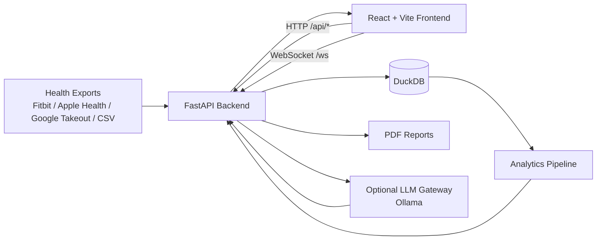
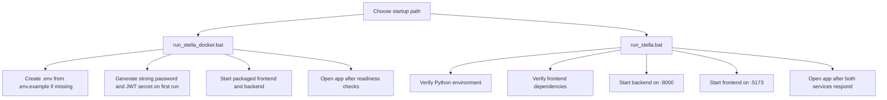
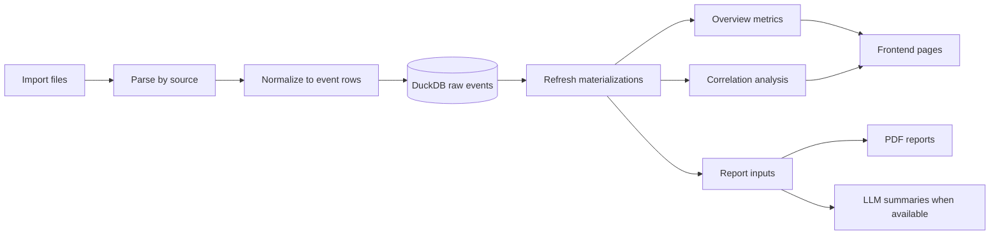
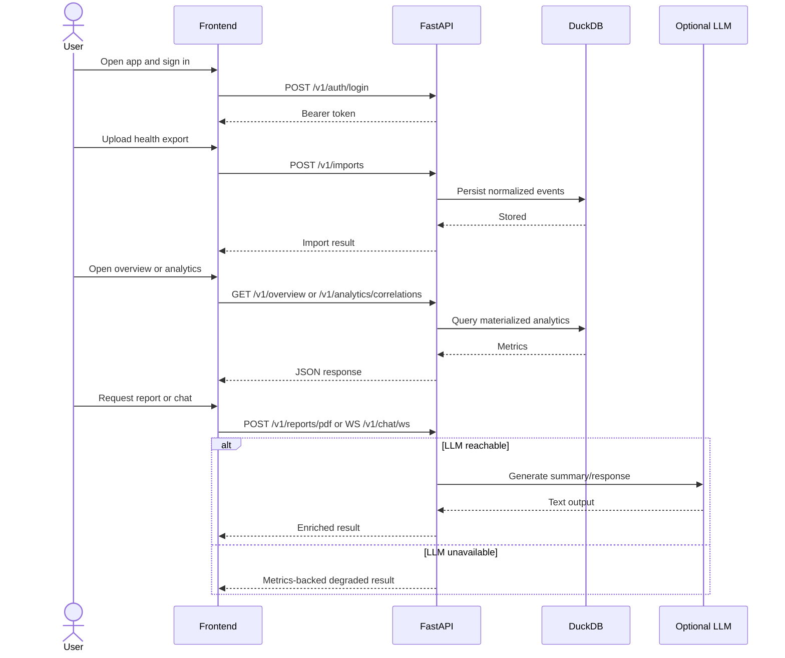

# Stella

Stella is a single-user, local-first health analytics app. The active product is a `FastAPI` backend, a `React + Vite` frontend, `DuckDB` local storage, and an optional `Ollama`-backed LLM layer that degrades cleanly to metrics-only behavior when the model is unavailable.

The supported paths are simple:

- `run_stella_docker.bat` is the canonical install path
- `run_stella.bat` is the supported local development path
- `archive/` and `tools/legacy/` are not part of the active runtime

## Contents

- [What It Does](#what-it-does)
- [Architecture](#architecture)
- [Startup Flows](#startup-flows)
- [Data Pipeline](#data-pipeline)
- [Request Lifecycle](#request-lifecycle)
- [Feature Matrix](#feature-matrix)
- [Quickstart](#quickstart)
- [API Surface](#api-surface)
- [Runtime Data](#runtime-data)
- [Troubleshooting](#troubleshooting)
- [Contributing](#contributing)
- [Repo Map](#repo-map)

## What It Does

Stella imports personal health exports, normalizes them into analytics-ready events, and exposes:

- overview metrics
- correlation analysis
- PDF reports
- streaming chat

First run starts empty by design. No sample data is auto-imported in supported product paths. Importing real data is what unlocks the main product surface.

Supported import story referenced in the repo includes Fitbit, Apple Health, Google Takeout, Oura, Garmin, and manual CSV exports.

## Architecture



### Product shape

| Layer | Current role |
| --- | --- |
| Frontend | Overview, analytics, chat, reports, import UI |
| Backend | Auth, ingestion, analytics routes, health checks, reporting, chat |
| Storage | DuckDB-backed normalized events and materialized analytics |
| AI | Optional summary/report/chat assist through Ollama |
| Packaging | Docker-first install path plus local development launcher |

## Startup Flows



### Runtime contract

- packaged app target: `http://127.0.0.1:5173`
- frontend talks to backend through same-origin `/api/*` and `/ws`
- Docker runtime data lives in `stella-runtime`
- local runtime data stays outside repo root
- Docker mode requires explicit strong auth
- local dev keeps convenience auth defaults

## Data Pipeline



### Operational notes

- the backend writes uploads into the runtime area, not repo root
- readiness includes both data presence and LLM health information
- the scheduler can refresh materializations when enabled
- when the LLM is unreachable, Stella should keep metrics and reports usable

## Request Lifecycle



## Feature Matrix

| Capability | Docker-first | Local dev | LLM available | LLM unavailable |
| --- | --- | --- | --- | --- |
| Launch app | Yes | Yes | Yes | Yes |
| Auth | Yes | Yes | Yes | Yes |
| Import health files | Yes | Yes | Yes | Yes |
| Overview metrics | Yes | Yes | Yes | Yes |
| Correlation analytics | Yes | Yes | Yes | Yes |
| PDF reports | Yes | Yes | Yes | Yes |
| Chat | Yes | Yes | Full behavior | Degraded behavior |
| Summary generation | Yes | Yes | Full behavior | Fallback / metrics-only |

## Quickstart

### Docker-first

Use this when you want the supported install path.

```bash
run_stella_docker.bat
```

Manual compose equivalent:

```bash
docker compose up -d --build
docker compose down
```

Optional real Ollama sidecar:

```bash
docker compose --profile local-llm up -d --build
```

Expected behavior:

- `.env` is created from `.env.example` if needed
- strong Docker credentials are generated on first run
- frontend and backend are started as a packaged stack
- the app opens after readiness checks pass

### Development

Use this when you are working inside the repo.

```bash
run_stella.bat
```

Expected behavior:

- Python and frontend dependencies are checked
- backend starts on `http://127.0.0.1:8000`
- frontend starts on `http://127.0.0.1:5173`
- the browser opens after both services are reachable

## API Surface

| Route | Method | Auth | Purpose |
| --- | --- | --- | --- |
| `/healthz` | `GET` | No | Basic liveness |
| `/readyz` | `GET` | No | Runtime readiness, data state, LLM state |
| `/v1/auth/login` | `POST` | No | Issue access token |
| `/v1/imports` | `POST` | Yes | Ingest uploaded files |
| `/v1/overview` | `GET` | Yes | Return overview analytics |
| `/v1/analytics/correlations` | `GET` | Yes | Return correlation analysis |
| `/v1/reports/pdf` | `POST` | Yes | Generate PDF report |
| `/v1/chat/ws` | `WS` | Yes | Stream chat responses |

## Runtime Data

By default, Stella keeps runtime state out of the repository.

| Environment | Runtime location |
| --- | --- |
| Windows | `%LOCALAPPDATA%\Stella` |
| macOS | `~/Library/Application Support/Stella` |
| Linux | `${XDG_DATA_HOME:-~/.local/share}/stella` |
| Docker | `stella-runtime` named volume |

The runtime directory or volume holds:

- generated DuckDB database
- uploaded files
- copied local `llm_config.yaml`

### Docker runtime environment

Use `.env.example` as the template:

```env
STELLA_FRONTEND_ORIGIN=http://localhost:5173
STELLA_USERNAME=stella
STELLA_PASSWORD=GENERATED_AT_FIRST_RUN
STELLA_JWT_SECRET=GENERATED_AT_FIRST_RUN
```

## Troubleshooting

### Docker startup fails early

- make sure Docker Desktop is installed and running
- make sure `docker compose` is available
- rerun `run_stella_docker.bat` after Docker is healthy

### App loads but chat or summaries are degraded

- this is expected when Ollama is unavailable
- Stella is designed to keep metrics-backed behavior working without the model
- enable the `local-llm` profile if you want the real Docker-side Ollama path

### First run looks empty

- this is expected
- Stella starts with `has_data=false`
- import real health data before expecting overview metrics, reports, or useful chat

### Login works differently in dev and Docker

- Docker mode uses explicit generated credentials from `.env`
- local dev keeps convenience auth defaults

### Repo state gets confusing

- do not work directly on `main`
- use a `codex/...` or other feature branch
- merge through PRs
- sync local `main` to `origin/main` instead of accumulating local-only commits

## Contributing

Use branch-first workflow. Keep `main` clean.

1. Create a feature branch from `main`
2. Make and verify changes there
3. Push the branch
4. Open a PR
5. Merge to `main`
6. Resync local `main` from `origin/main`

Primary checks in the repo:

```bash
ruff check .
pytest
cd frontend && npm run test
cd frontend && npm run build
cd frontend && npm run test:e2e
docker compose build backend
docker compose build frontend
python tools/smoke/docker_smoke.py --mode all
```

Release process reference: [`docs/release-checklist.md`](./docs/release-checklist.md)

## Repo Map

```text
.
|-- analytics/    Feature extraction, anomaly logic, pipelines, storage
|-- archive/      Old code kept out of the active runtime
|-- backend/      FastAPI app, auth, config, reports
|-- data/         Project data assets and fixtures
|-- docs/         Release checklist and docs
|-- frontend/     React + Vite app, tests, E2E
|-- llm/          LLM gateway and runtime integration
|-- tests/        Python test suite
`-- tools/        Smoke tooling and legacy scripts
```

## Notes

This README is intentionally technical. The goal is to make startup paths, system shape, failure modes, and contributor workflow obvious without pretending the repo is something it is not.
