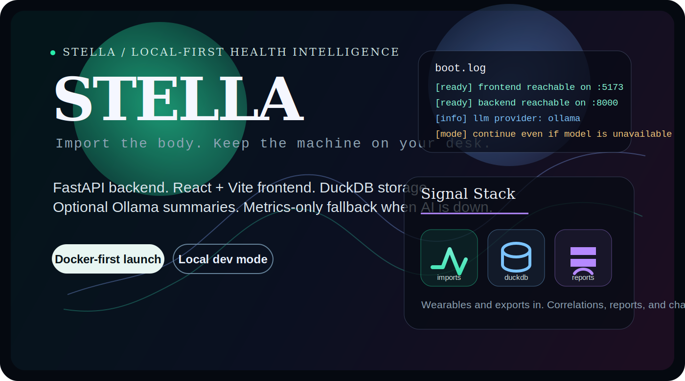
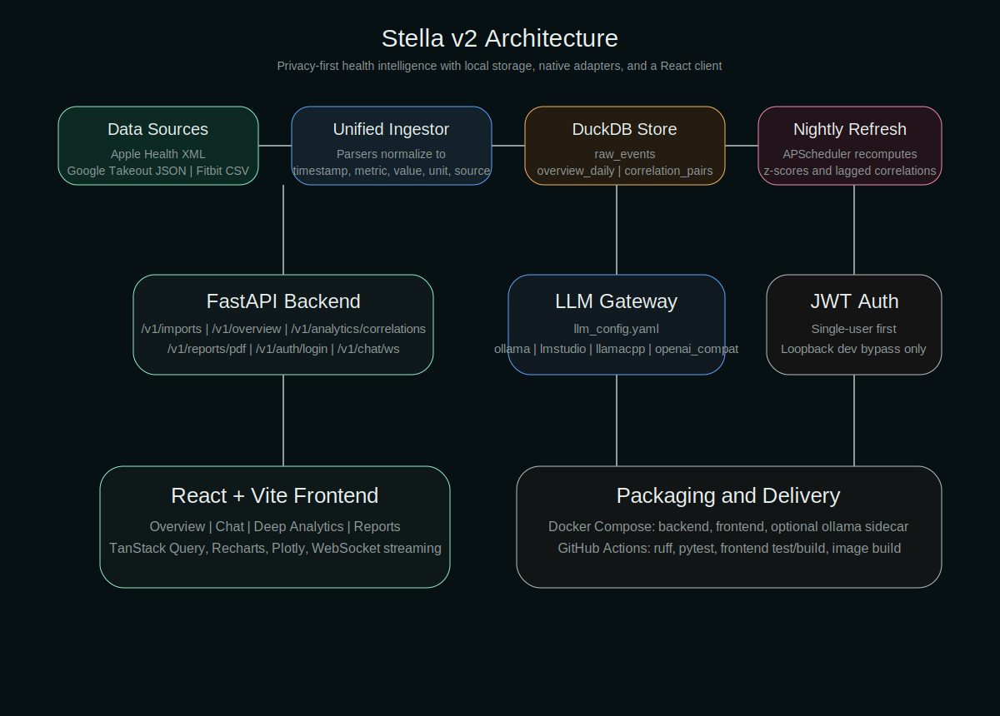

<p align="center">
  
</p>

<p align="center">
  <strong>Local-first health analytics with a product spine, not a notebook vibe.</strong>
</p>

<p align="center">
  Stella is a single-user health intelligence app built from a <code>FastAPI</code> backend, a <code>React + Vite</code> frontend, <code>DuckDB</code> local storage, and optional <code>Ollama</code>-backed summaries.
  <br />
  It runs on your machine, keeps runtime data out of the repo, and stays useful even when the model layer is unavailable.
</p>

<p align="center">
  
  
  
  
</p>

<p align="center">
  <a href="#the-pitch">The Pitch</a> •
  <a href="#boot-sequence">Boot Sequence</a> •
  <a href="#signal-path">Signal Path</a> •
  <a href="#first-contact">First Contact</a> •
  <a href="#quality-gate">Quality Gate</a> •
  <a href="#repo-topography">Repo Topography</a>
</p>

## The Pitch

Stella is not trying to be another cloud dashboard with a wellness skin on top. The active product is a local-first runtime that imports personal health exports, normalizes them into analytics-ready tables, and turns them into overview metrics, correlations, reports, and chat.

The current supported product surface is:

| Layer | What exists now |
| --- | --- |
| Backend | FastAPI endpoints for auth, imports, overview, correlations, PDF reports, health checks, and WebSocket chat |
| Frontend | React + Vite app with overview, analytics, chat, reports, and import flows |
| Storage | DuckDB-backed normalized event storage and materialized analytics |
| AI layer | Ollama-backed summaries with graceful metrics-only fallback |
| Packaging | Docker-first install path for non-technical use, plus a local dev launcher |

### Hard truths

- `run_stella_docker.bat` is the canonical install path.
- `run_stella.bat` is the supported contributor path.
- `archive/` and `tools/legacy/` are not part of the active runtime.
- Stella starts empty on purpose. No sample data is auto-imported in supported product paths.
- If Ollama is unavailable, the product should degrade instead of collapsing.

## Boot Sequence

Two startup paths are first-class. Pick the one that matches your job.

| Mode | Use it when | Entry point | What happens |
| --- | --- | --- | --- |
| Docker-first | You want the supported product install path | `run_stella_docker.bat` | Creates `.env` from `.env.example` if needed, generates strong credentials on first run, boots the packaged stack, and opens the app once frontend and backend are reachable |
| Local dev | You are actively developing inside the repo | `run_stella.bat` | Verifies Python and frontend dependencies, starts backend on `:8000`, starts Vite on `:5173`, and opens the browser after both are ready |

### Manual compose path

```bash
docker compose up -d --build
docker compose down
```

Optional Ollama sidecar:

```bash
docker compose --profile local-llm up -d --build
```

### Runtime contract

The packaged app is expected on `http://127.0.0.1:5173`.

- Frontend talks to backend through same-origin `/api/*` and `/ws`
- Docker runtime data lives in the named volume `stella-runtime`
- Local runtime data stays outside repo root
- Docker mode requires explicit strong auth values
- Local dev keeps convenience auth defaults

## Signal Path

<p align="center">
  
</p>

This is the product loop in plain English:

1. Import wearable exports and health files.
2. Normalize them into stable event rows inside DuckDB.
3. Materialize overview and correlation views for the frontend.
4. Generate reports and optional language summaries on top.
5. Keep the machine usable even if the model layer disappears.

### Active API surface

| Route | Purpose |
| --- | --- |
| `GET /healthz` | Basic liveness |
| `GET /readyz` | Runtime readiness plus data and LLM status |
| `POST /v1/auth/login` | Single-user auth token issuance |
| `POST /v1/imports` | File ingestion |
| `GET /v1/overview` | Overview analytics |
| `GET /v1/analytics/correlations` | Correlation analysis |
| `POST /v1/reports/pdf` | PDF report generation |
| `WS /v1/chat/ws` | Streaming chat |

## First Contact

On a fresh install, the right behavior is boring and honest:

- Stella launches successfully with no imported data.
- Login and overview make it clear the app is installed but empty.
- Importing real data unlocks overview, analytics, reports, and chat.
- If the LLM is unreachable, Stella still provides metrics-backed behavior instead of a broken UI.

Supported import story in the repo currently references sources like Fitbit, Apple Health, Google Takeout, Oura, Garmin, and manual CSV exports.

### Docker runtime environment

Use `.env.example` as the template. The Docker path needs these values:

```env
STELLA_FRONTEND_ORIGIN=http://localhost:5173
STELLA_USERNAME=stella
STELLA_PASSWORD=GENERATED_AT_FIRST_RUN
STELLA_JWT_SECRET=GENERATED_AT_FIRST_RUN
```

The launcher generates strong runtime credentials on first run when `.env` does not exist.

### Runtime data

- Windows: `%LOCALAPPDATA%\Stella`
- macOS: `~/Library/Application Support/Stella`
- Linux: `${XDG_DATA_HOME:-~/.local/share}/stella`
- Docker: `stella-runtime` named volume

That runtime area holds the generated DuckDB database, uploads, and copied local `llm_config.yaml`.

## Quality Gate

Stella is being pushed toward a Docker-first product release, so the README should not pretend ad hoc runs are enough. The primary checks in the repo are:

```bash
ruff check .
pytest
cd frontend && npm run test
cd frontend && npm run build
cd frontend && npm run test:e2e
docker compose build backend
docker compose build frontend
python tools/smoke/docker_smoke.py --mode all
```

Release discipline lives in [`docs/release-checklist.md`](./docs/release-checklist.md).

The release line is simple:

- first Docker-first milestone: `v0.1.0`
- patch releases for bug-fix-only changes
- minor releases for user-visible polish and workflow improvements

## Repo Topography

```text
.
|-- backend/      FastAPI app, auth, config, reports
|-- frontend/     React + Vite client, tests, E2E
|-- analytics/    feature extraction, anomalies, pipelines, storage
|-- llm/          model gateway and runtime integration
|-- tools/smoke/  Docker smoke runner
|-- docs/         release notes and project docs
|-- archive/      old code kept out of the active product
`-- tests/        Python test suite
```

## Why This README Looks Like This

Stella is already more product than prototype, so the README should read like an installation surface and a systems brief, not a dump of setup trivia. The flash is intentional. The claims are not.
